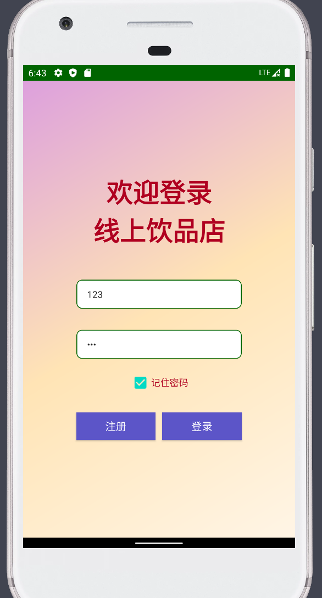
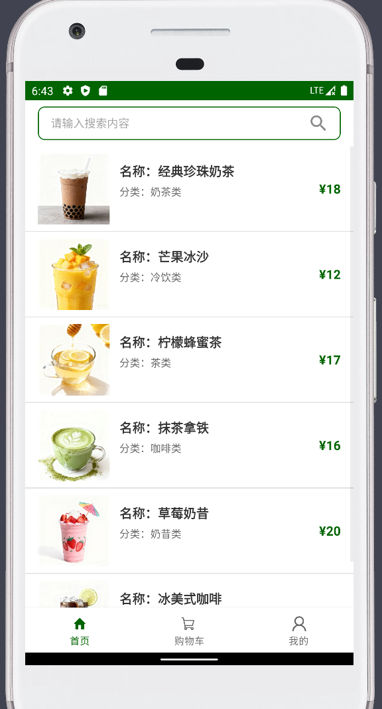
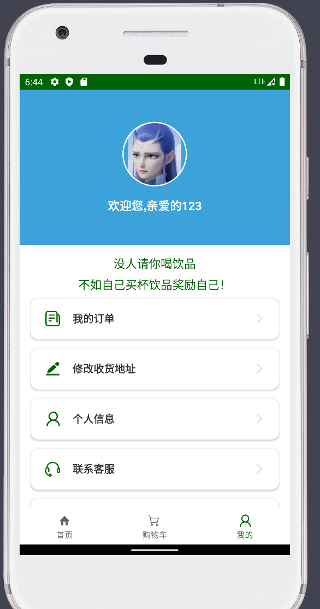
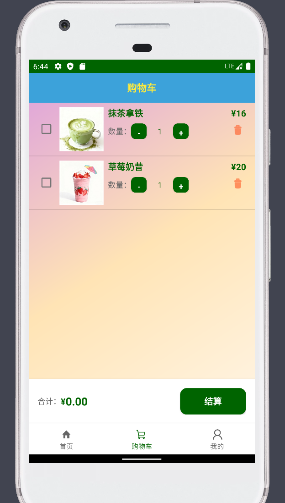

# 线上饮品店 (YinPin)

一个基于 Android 平台的线上饮品店应用，提供饮品浏览、购物车管理、订单记录等功能。

## 📱 项目简介

线上饮品店是一个完整的 Android 电商应用，用户可以浏览各种饮品、添加到购物车、下单购买，并查看历史订单记录。应用采用 Material Design 设计规范，界面简洁美观。

## 📱 界面预览
#### 登录页面


#### 首页 - 商品列表


#### 个人中心


#### 购物车



## ✨ 主要功能

### 1. 用户系统
- **用户注册**：新用户可以通过注册功能创建账户
- **用户登录**：支持用户名和密码登录
- **记住密码**：可选择记住登录信息，方便下次快速登录
- **用户信息管理**：查看和编辑个人信息

### 2. 商品浏览
- **商品列表**：展示所有可购买的饮品商品
- **商品搜索**：支持按商品名称或描述进行搜索
- **商品分类**：包括奶茶类、冷饮类、茶类、咖啡类、奶昔类等
- **商品详情**：查看商品的详细信息，包括名称、价格、描述、图片等

### 3. 购物车功能
- **添加商品**：在商品详情页将商品添加到购物车
- **购物车管理**：查看购物车中的所有商品
- **商品选择**：支持多选商品进行批量结算
- **删除商品**：可以删除购物车中的商品
- **价格计算**：自动计算选中商品的总价

### 4. 订单管理
- **下单购买**：在购物车中选择商品进行结算
- **订单记录**：查看历史购买记录
- **订单详情**：查看每个订单的详细信息

### 5. 其他功能
- **关于页面**：查看应用相关信息
- **底部导航**：便捷的底部导航栏，快速切换首页、购物车、个人中心

## 🛠️ 技术栈

- **开发语言**：Java
- **最低 SDK 版本**：21 (Android 5.0)
- **目标 SDK 版本**：34 (Android 14)
- **编译 SDK 版本**：34
- **UI 框架**：
  - AndroidX AppCompat
  - Material Design Components
- **图片加载**：Glide 4.16.0
- **数据存储**：SQLite 数据库
- **架构模式**：MVC 架构

## 📦 项目结构

```
app/src/main/java/com/example/yinpin/
├── activity/          # Activity 活动类
│   ├── LoginActivity.java        # 登录页面
│   ├── RegisterActivity.java     # 注册页面
│   ├── MainActivity.java          # 主页面（底部导航）
│   ├── DetailActivity.java        # 商品详情页
│   ├── InfoActivity.java          # 用户信息页
│   ├── RecordActivity.java        # 订单记录页
│   └── AboutActivity.java         # 关于页面
├── fragment/          # Fragment 碎片类
│   ├── MainFragment.java          # 首页商品列表
│   ├── CartFragment.java          # 购物车页面
│   └── MeFragment.java            # 个人中心页面
├── adapter/           # 适配器类
│   ├── StuffAdapter.java          # 商品列表适配器
│   ├── CartAdapter.java           # 购物车适配器
│   └── RecordAdapter.java         # 订单记录适配器
├── entity/            # 实体类
│   ├── User.java                  # 用户实体
│   ├── Stuff.java                 # 商品实体
│   └── Record.java                # 订单记录实体
├── sqlite/            # 数据库操作类
│   ├── DBUser.java                # 用户数据库操作
│   ├── DBStuff.java               # 商品数据库操作
│   ├── DBCart.java                # 购物车数据库操作
│   └── DBRecord.java              # 订单记录数据库操作
├── utils/             # 工具类
│   ├── CurrentUserUtils.java      # 当前用户工具类
│   ├── SqliteUtils.java           # 数据库工具类
│   ├── AppUtils.java              # 应用工具类
│   └── MyGlideModule.java         # Glide 配置模块
└── MyApplication.java # Application 类（应用初始化）
```

## 🗄️ 数据库设计

应用使用 SQLite 数据库存储数据，主要包括以下表：

- **用户表 (User)**：存储用户信息（用户名、密码等）
- **商品表 (Stuff)**：存储商品信息（ID、名称、标题、分类、价格、图片等）
- **购物车表 (Cart)**：存储购物车信息（用户、商品ID等）
- **订单记录表 (Record)**：存储购买记录（用户、商品、价格、时间等）

## 🎨 商品信息

应用内置以下饮品商品：

1. **经典珍珠奶茶** - ¥18.00 (奶茶类)
2. **芒果冰沙** - ¥12.00 (冷饮类)
3. **柠檬蜂蜜茶** - ¥17.00 (茶类)
4. **抹茶拿铁** - ¥16.00 (咖啡类)
5. **草莓奶昔** - ¥20.00 (奶昔类)
6. **冰美式咖啡** - ¥13.00 (咖啡类)

## 📝 开发说明

### 主要依赖

```gradle
dependencies {
    implementation 'androidx.appcompat:appcompat:1.3.1'
    implementation 'com.google.android.material:material:1.4.0'
    implementation 'com.github.bumptech.glide:glide:4.16.0'
    annotationProcessor 'com.github.bumptech.glide:compiler:4.16.0'
    implementation "com.github.bumptech.glide:okhttp3-integration:4.16.0"
}
```

### 权限说明

应用需要以下权限：
- `INTERNET`：用于网络请求

## 🔧 配置说明

- **应用包名**：`com.example.yinpin`
- **应用名称**：线上饮品店
- **版本号**：1.0
- **版本代码**：1


